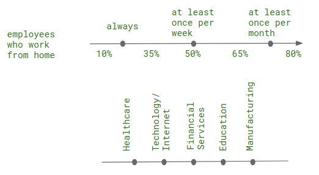

# Factotum Care

This is a collection of resources to help you tackle teleworking-related challenges.

---

In 2019, 5.3% of employed people in the EU usually worked from home and over 10% reported that sometimes did. 

During the COVID19 pandemic and the lockdown policies adopted by many countries, those numbers have increased many fold. 
To stay safe we stay home, but that imposes many challenges. Factotum Care’s mission is to help employees work better from home.

---

### The Problem

The vast majority of the workforce has not been prepared to work remotely and often neglects the risks it may harbor in regards to physical and mental health. Ill-advised impromptu workstations can cause back and neck pain to a worker, whereas confinement and minimal face-to-face interaction can deteriorate one's mental health.

Furthermore, during the COVID19 pandemic, working from home has an added layer of complexity in regards to logistics and stress. Employees who are parents and now have to care for their children throughout the day, struggle to work efficiently and often have to work through the night and weekend to manage the workload.

Take it from us, we’ve been there: Working from home always brings excitement at first but as the days pass, you will be going through scattered resources to tackle its challenges.

### The Solution

Factotum Care is an online platform to provide everything that is needed for each remote worker **during and after** the COVID19, **subscription free**.

Factotum Care provides tips for employees who work part or full time remotely; for people who live alone or not; for people that work in tech or not.

Factotum Care provides personalized tools to help employees stay efficient and healthy. It reminds them to take a break to stretch and drink water. Factotum Care allows frolleagues and families to sync their breaks based on their scheduled meetings and pomodoro intervals.
 

### Market Size

***Available market*** today:

***Target market*** today:

- 10% of european workforce working occasionally from home

The target market in 5 years is expected to increase.

### BuisinessModel

Examples:
Advertisements for kid's learning
Advertisements for workspace retailers.
